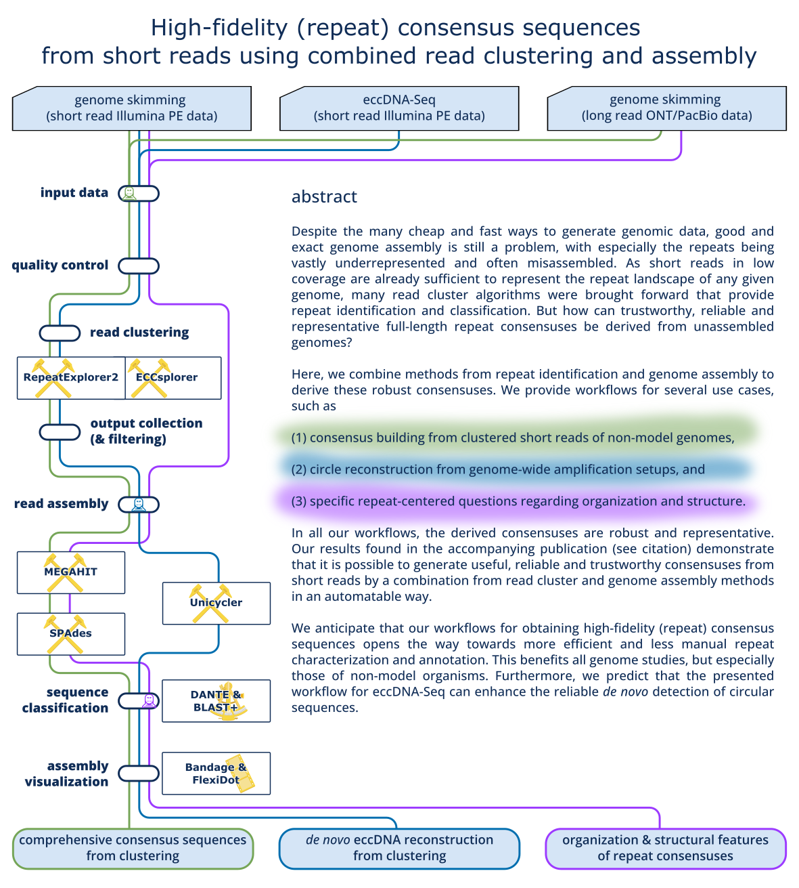

# repeats_and_circles_assembly

Workflows for the assembly of repeats and circles from genome-skimming or eccDNA-Seq read data.

---

## Overview - What are the repeats and circles assembly workflows? 

### Abstract

Despite the many cheap and fast ways to generate genomic data, good and exact genome assembly is still a problem, with especially the repeats being vastly underrepresented and often misassembled. As short reads in low coverage are already sufficient to represent the repeat landscape of any given genome, many read cluster algorithms were brought forward that provide repeat identification and classification. But how can trustworthy, reliable and representative full-length repeat consensuses be derived from unassembled genomes?

Here, we combine methods from repeat identification and genome assembly to derive these robust consensuses. We provide workflows for several use cases, such as

(<b>(1)</b>) consensus building from clustered short reads of non-model genomes, 

(2) circle reconstruction from genome-wide amplification setups, and 

(3) specific repeat-centered questions regarding organization and structure.

In all our workflows, the derived consensuses are robust and representative. Our results found in the accompanying publication (see citation) demonstrate that it is possible to generate useful, reliable and trustworthy consensuses from short reads by a combination from read cluster and genome assembly methods in an automatable way. 

We anticipate that our workflows for obtaining high-fidelity (repeat) consensus sequences opens the way towards more efficient and less manual repeat characterization and annotation. This benefits all genome studies, but especially those of non-model organisms. Furthermore, we predict that the presented workflow for eccDNA-Seq can enhance the reliable de novo detection of circular sequences. 

### 1. Create comprehensive consensus sequences from repeat clusters

Find detailed instructions on the workflow [here](clust_assemble/README.md).

### 2. Reconstruct circular sequences from eccDNA candidate clusters

Find detailed instructions on the workflow [here](circ_assemble/README.md).

### 3. Assemble consensus sequences from highly abundant repeats and explorer organization and structural features

Find detailed instructions on the workflow [here](skim_assemble/README.md).

## Citation 

High-fidelity (repeat) consensus sequences from short reads using combined read clustering and assembly.

Ludwig Mann, Kristin Balasch, Nicola Schmidt, Tony Heitkam.

<i>BMC Genomics</i> <b>25</b>, 109 (2024).

[10.1186/s12864-023-09948-4](https://doi.org/10.1186/s12864-023-09948-4)
